# Designprüfung: Generalprobe

Geprüft am 02.10.2026 direkt auf `http://localhost:3100/` mit dem
Product-Design-Audit-Skill. Desktop: 1280×720. Handy: 390×844.
Screenshots stammen ausschließlich aus diesem Durchlauf. Bewertet wurden
Startseite, alle drei Mini-Antworten, Übersicht, Dating-Kategorie und Einstieg
in die Dating-Situation. Die vollständigen Filme wurden dabei nicht durchgespielt.
Keine Änderung an der geprüften Seite vorgenommen.

## Urteil

Die Grundlage ist verständlich und ordentlich. Die eigene Illustration, die
Mini-Entscheidung und der Name „Generalprobe“ haben Potenzial. Die aktuelle
Gestaltung transportiert dieses Potenzial jedoch zu schwach. Sie wirkt auf mich
wie eine herkömmliche Lernplattform mit eigenen Zeichnungen: große Überschrift,
Erklärabsatz, zwei Aktionen, Dreierschritt, gleichförmige Karten und Quellenblock.
Das ist eine gestalterische Bewertung, kein Ergebnis einer Nutzerstudie.

Das Problem lässt sich nicht allein durch eine weitere Schriftart oder Farbe
lösen. Die Situation braucht mehr Gewicht im ersten Bildschirm; danach braucht
die Seite weniger Wiederholung und einen klareren eigenen Bildrhythmus.

## Geprüfter Weg und Zustand

| Schritt | Ansicht/Aktion | Bewertung |
|---|---|---|
| 1 | Desktop-Startseite | Klarer Nutzen, aber Antworten zunächst unten abgeschnitten |
| 2 | Mini-Demo: B, danach A und C; Wiederholen | Alle drei Zweige funktionieren; Bildbeschriftungen überlagern sich |
| 3 | „So läuft es ab“ | Verständlich; ausführlich und nach dem Ausprobieren teilweise redundant |
| 4 | Kategorien und Empfehlungen | Stöbern funktioniert; ähnliche Bilder und Karten wiederholen sich |
| 5 | Quellen-Navigation | Abschnitt erreichbar; Links führen zu Situationen, nicht zu Originalquellen |
| 6 | „Üben“ und Dating-Filter | Funktioniert; sechs Inhalte werden auf fünf Bereiche verteilt |
| 7 | Dating-Kategorie | Eine Karte links, viel ungenutzte Fläche |
| 8 | Dating-Situation öffnen | Startknopf vorhanden; Titel und Einleitung darunter wiederholt |
| 9 | Handy: Start, Antwort, Übersicht, Situationsstart | Große Antwortflächen; Header läuft seitlich über, Filmhinweise sehr klein |
| 10 | Antwort mit Enter wählen, anschließend Tab | Funktioniert; nächster Tab erreicht den Startlink, Fokus sichtbar |

## Befunde mit konkreten Verbesserungen

### 1. Die erste Ansicht erklärt mehr, als sie erleben lässt — hohe Priorität

Die 61-Pixel-Überschrift beansprucht auf dem Desktop fünf Zeilen. Der Begleittext
erklärt gleichzeitig Themen, Länge, Zeichnungen, Entscheidungen, Konsequenzen und
Studien. Rechts liegen Szene und Frage in getrennten Flächen. Bei 1280×720 sind
die Antwortkarten nicht vollständig im ersten Bildschirm sichtbar.

Auf dem Handy steht der erste Antwortknopf bei Dokumentposition etwa 1165 Pixel.
Der erste Bildschirm besteht fast vollständig aus Text, Knöpfen und Angaben.
Damit wird das Versprechen „direkt ausprobieren“ zu spät eingelöst.

Verbesserung: Eine kompaktere Nutzenzeile, ein kurzer Rollenkontext und die
Entscheidung gemeinsam in den ersten Bildschirm bringen. Der Satz „Mach den
Fehler hier. Nicht im echten Leben.“ ist bereits vorhanden, wird aber im Footer
versteckt. Er könnte eine stärkere Rolle bekommen. Handy und Desktop brauchen
dafür unterschiedliche Anordnungen; nur dieselben Blöcke untereinander zu setzen
reicht nicht.

### 2. Die Mini-Szene hat zu wenig Kontext — hohe Priorität

Der Besucher soll zwischen 57.500 Euro, einer Spanne und einer Gegenfrage wählen.
Die Wunschzahl und die Ausgangslage fehlen an dieser Stelle. Erst die weiter unten
stehende Situationskarte nennt 55.000 Euro. Man entscheidet deshalb leicht nach
vermuteter Quizlogik statt aus einer nachvollziehbaren Rolle.

Verbesserung: Ein kurzer Satz wie „Du möchtest 55.000 Euro. Das Gespräch läuft
gut. Jetzt fragt HR nach deiner Zahl.“ Die Optionen und Reaktionen anschließend
auf diesen Kontext abstimmen. Die Demo soll einen interessanten Moment zeigen,
ohne bereits eine allgemeingültig richtige Antwort zu behaupten.

### 3. Rückmeldung und Illustration sind räumlich überladen — hoher Fixbedarf

Nach B überdeckt die dunkle Preisbeschriftung einen Teil der grünen Sprechblase.
Auch bei A und C konkurrieren die Beschriftungen im oberen Bildbereich. Dazu
erscheinen Reaktion, Gehirnkommentar, zwei Aktionen und ein weiterer Erklärsatz
unter dem Bild. Der Besucher muss an mehreren Stellen lesen, um eine einzige
Konsequenz zu verstehen.

Verbesserung: Die eigene Antwort in der Sprechblase, die Reaktion bei Frau Brandt
und anschließend höchstens ein kurzer Gehirnkommentar. Eine optionale Zahl hat
einen eigenen festen Platz außerhalb der Sprechblasen. Für sämtliche Textlängen
prüfen. Dramaturgisch würde eine kurze Pause mit Blickwechsel stärker wirken
als weitere gleichzeitig sichtbare Textkästen. Die Gesichter ändern sich bereits;
diese vorhandene Reaktion sollte deutlicher inszeniert werden.

### 4. Zu viele Elemente erhalten dieselbe Kartenbehandlung — mittlere Priorität

Demo, Kategorien, Empfehlungen, Quellen und Filter nutzen helle bzw. leicht
getönte Flächen, gerundete Ecken und weiche Schatten. Das ergibt Konsistenz,
aber zu wenig Unterschied zwischen Entscheidung, Navigation und Erklärung.
Die Kategorie „Alle“ setzt zwar einen dunklen Kontrast, erzeugt jedoch allein
noch keinen abwechslungsreichen Seitenaufbau.

Verbesserung: Antwortkarten als klar erkennbare besondere Form behalten.
Situationen dürfen wie kleine Episodenplakate wirken, Quellen wie schlichte
Anmerkungen. Schatten nur einsetzen, wenn sie eine Ebene oder Aktion verdeutlichen.
Nicht die gesamte Seite mit zusätzlichen Effekten dekorieren.

### 5. Kategorien und Empfehlungen wiederholen sich — hohe strukturelle Priorität

Fünf große Bereichskarten plus „Alle“ führen überwiegend zu einem einzigen
Inhalt. Darunter folgen nochmals Gehalt, Dating und Wohnung mit ähnlichen
Vorschaubildern. Bei „Üben“ folgt jeder kleine Bereich wieder mit eigener
Überschrift und „Nur ... zeigen“. Dating endet in einer Ein-Karten-Seite.

Verbesserung: Die sechs Situationen in einer gemeinsamen Übersicht zeigen,
Bereiche als leichte Filter darüber. Auf der Startseite kann eine Situation
größer hervorgehoben werden; die übrigen sollten trotzdem gleich erreichbar
sein. Separate Kategorien werden nützlich, sobald dort tatsächlich Auswahl
entsteht. Es ist kein zusätzlicher Inhalt nötig, um die vorhandenen sechs
Situationen überzeugender zu präsentieren.

### 6. Zeichnungen zeigen häufig die gleiche Bildidee — mittlere Priorität

Jonas' grüner Hoodie, eine Sitzposition und ein ähnlicher skeptischer Ausdruck
erscheinen in mehreren Vorschaubildern. Das unterstützt Wiedererkennung, reduziert
aber die Unterschiede zwischen den Geschichten. Meine Einschätzung: Die sehr
runden, freundlichen Gesichter passen eher zu einem allgemeinen Lernangebot als
zu einer Serie voller unangenehmer Erwachsenensituationen.

Verbesserung: Die Figuren behalten, aber pro Situation den entscheidenden Konflikt
größer zeigen: eine unbeantwortete Geldnachricht, ein auffällig günstiges Inserat,
eine unangenehme Pause am Tisch. Unterschiedliche Perspektiven, Gesten und
Gesichtsausdrücke helfen mehr als zusätzliche kleine Hintergrunddetails. Die
Zeichnungen sind ein guter Ausgangspunkt, müssen nicht komplett ersetzt werden.

### 7. Typografie und Farbe sind brauchbar, aber noch keine eigene Bildsprache

Bricolage Grotesque und Hanken Grotesk sind tatsächlich eingebunden. Das bestätigt
aber nicht automatisch eine besondere Gestaltung. Die Überschrift hat Gewicht,
führt jedoch zum erwartbaren Muster „riesiger Nutzenclaim plus Erklärung“.
Papierweiß, Navy und Teal wirken ruhig und zuverlässig, bislang wenig verspielt.

Verbesserung: Die Hauptszene zum dominanten Blickfang machen. Typografie kann
Dialog, Spannung und Reihenfolge unterstützen, statt nur große Überschriften zu
liefern. „Generalprobe“ bietet einen eigenen gedanklichen Rahmen: eine Szene
ausprobieren, erneut ansetzen, einen anderen Verlauf sehen. Dieser Rahmen sollte
im Verhalten und in der Sprache spürbar werden. Keine Pflicht zu Bühnenvorhang
oder anderen rein dekorativen Theatermotiven.

### 8. Der Handy-Header ist messbar zu breit — sofort beheben

Bei 390 Pixeln Bildschirmbreite beträgt die Dokumentbreite 420 Pixel. Der
Zufall-Knopf reicht bis etwa x=420 und ist abgeschnitten. Das tritt auf der
Startseite, in der Übersicht und auf der Situationsseite auf.

Verbesserung: Den Header neu aufteilen, Abstände und Mindestbreiten korrigieren,
gegebenenfalls Zufall ins Menü verschieben. Den Fehler nicht lediglich mit
verstecktem horizontalem Überlauf kaschieren. Der bestehende Zeilenumbruch der
Kategorie-Filter und die großen Antwortknöpfe auf dem Handy funktionieren gut.

### 9. Situationsstart skaliert Text zu stark herunter — hoher Fixbedarf

Auf 390×844 ist das Video im Hochformat erreichbar; Drehen wird lediglich
empfohlen, nicht erzwungen. Positiv. Die vollständige Desktop-Titelkarte wird
jedoch so klein skaliert, dass Hinweise und Startbeschriftungen kaum lesbar sind.
Darunter stehen Titel und Einleitung nochmals groß.

Verbesserung: Mobile Bedienelemente und Hinweise außerhalb der skalierten Bühne
in normal lesbarer HTML-Schrift anzeigen. Den Startknopf als ausreichend große
Bedienfläche unabhängig von der Zeichnung gestalten. Informationen zwischen
Titelkarte und darunterstehendem Abschnitt aufteilen, statt alles zu wiederholen.
Der Play-Pfeil auf der Übersicht öffnet erst diese Startseite; die Beschriftung
sollte diese Erwartung deutlich machen.

### 10. Knopfkontrast reicht für den kleinen Text nicht aus — sofort beheben

Gemessene CSS-Farben: Weiß `#ffffff` auf Teal `#2f9e8f`, Verhältnis etwa 3,28:1.
„Ganze Situation spielen“ hat 16 Pixel fetten Text. Dafür sind 4,5:1 erforderlich.
„Situationen ansehen“ hat 18 Pixel fetten Text und liegt ebenfalls unter der
üblichen Schwelle für große fette Schrift. Lösung: das Knopfgrün abdunkeln und
alle relevanten Text-/Flächenpaare messen.

Quelle: [W3C, Mindestkontrast](https://www.w3.org/WAI/WCAG22/Understanding/contrast-minimum.html).

Die Antwort ließ sich mit Enter auslösen. Der nächste Tab erreichte den Link
„Ganze Situation spielen“, mit sichtbarer 2-Pixel-Fokusmarkierung. Nach der
Antwort selbst lag der Fokus auf dem Dokument; eine Live-Region war nicht vorhanden.
Ob ein Screenreader den neuen Inhalt zuverlässig vermittelt, bleibt daher offen.
Das muss mit einem Screenreader geprüft werden; geeignete Fokusführung oder eine
gezielte Ankündigung der Reaktion vorsehen. Keine pauschale Aussage zur gesamten
Barrierefreiheit.

### 11. Quellen sind benannt, aber hier nicht direkt erreichbar

Die Unterscheidung zwischen Studie, offizieller Warnung und Erfahrungswissen
ist positiv. Die vier Links führen allerdings nur zu den Situationen. Wer
„Quellen“ auswählt, kann die Originalbelege aus diesem Abschnitt nicht öffnen.

Verbesserung: Pro Beispiel einen direkten Link zum Beleg sowie eine knappe
Aussage, was genau belegt ist. Die ausführliche Erklärung kann weiterhin im
Rückblick liegen. Die wissenschaftlichen Aussagen selbst wurden in diesem
Design-Audit nicht inhaltlich nachgeprüft.

## Reihenfolge für die nächste Überarbeitung

1. Header-Überlauf, Knopfkontrast und überdeckte Sprechblasen beheben.
2. Den Einstieg mit Szene, Kontext und drei Antworten für Desktop UND Handy neu
   komponieren. Zunächst nur diesen Bereich in deutlich unterschiedlichen Entwürfen.
3. Mini-Reaktion als kurzen zusammenhängenden Moment gestalten.
4. Sechs Situationen direkt erreichbar machen, Kategorien als Filter behandeln.
5. Wiederholte Karten, Texte und Metadaten reduzieren; Vorschaubilder stärker
   unterscheiden. Erst anschließend zusätzliche Animationen verfeinern.

Erfolgskriterium für den nächsten Entwurf: Ein neuer Besucher erkennt auf Desktop
und Handy die Situation, versteht seine Rolle und kann die erste Antwort wählen,
ohne erst einen langen Erklärabsatz durcharbeiten zu müssen. Diese Hypothese mit
einigen Personen außerhalb des Projekts prüfen; nicht aus dem Entwurf allein ableiten.

## Grenzen der Prüfung

Keine vollständige Prüfung aller Filme, aller Browser, aller Bildschirmgrößen,
der Quelleninhalte, des Screenreader-Verhaltens oder der Einstellung „weniger
Bewegung“. Keine belastbare Ladezeitmessung: Die Seite läuft hier im Next.js-
Entwicklungsmodus. Übergangsbilder und noch nicht ausgelöste Scrollanimationen
wurden nicht als Layoutfehler gewertet. Sämtliche folgenden Screenshots zeigen
Ansichten, die im aktuellen Durchlauf sichtbar geprüft wurden.

## Bildbelege

### 1. Desktop-Einstieg
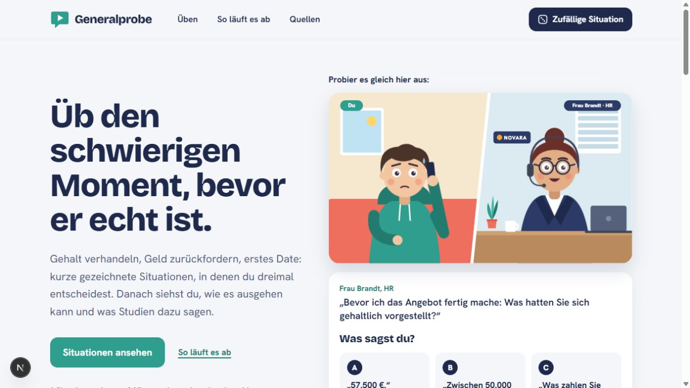

### 2. Antwort B: dunkle Preisbeschriftung über der Sprechblase
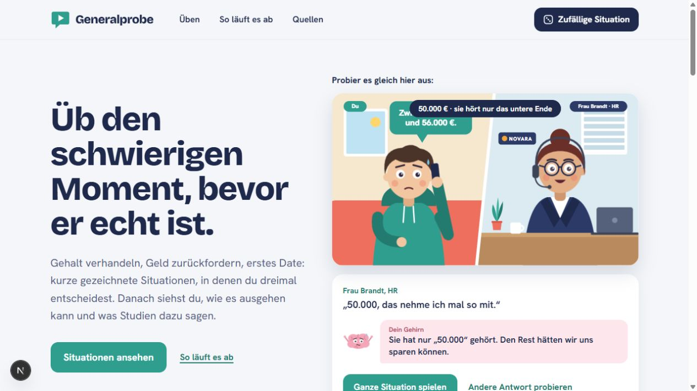

### 3. Ablauf im sichtbaren, fertig eingeblendeten Zustand
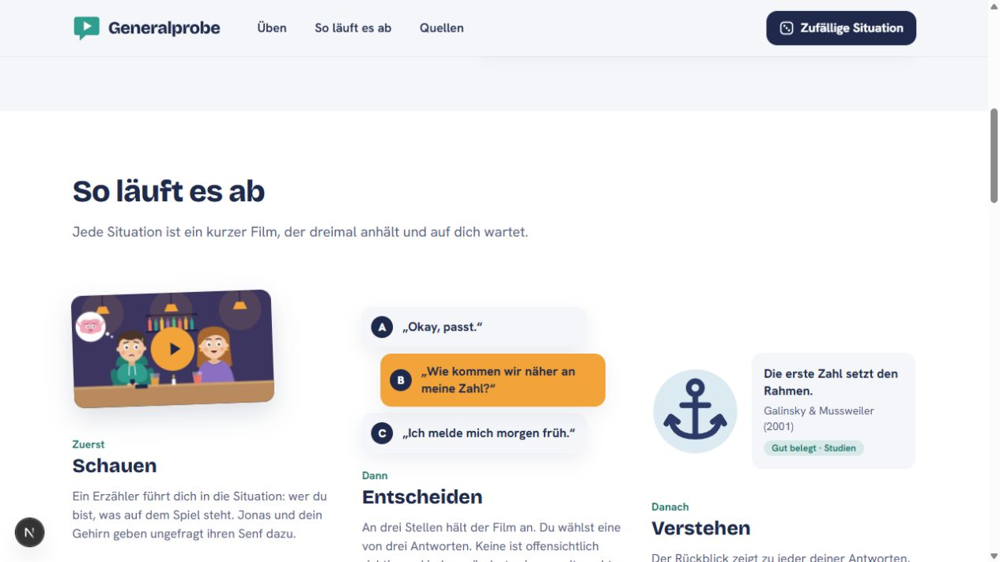

### 4. Kategorien und anschließende Empfehlungen
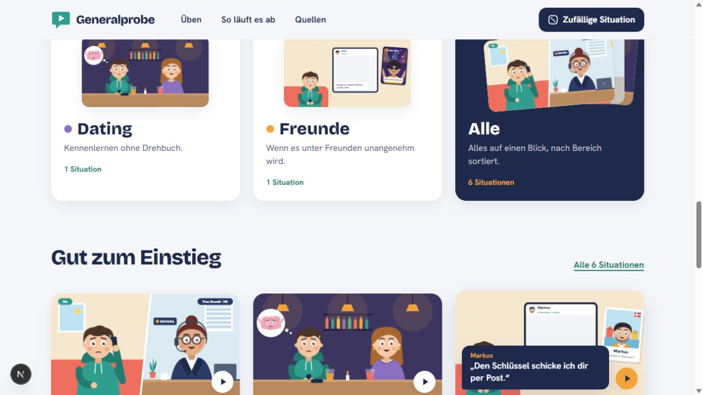

### 5. Quellenbereich
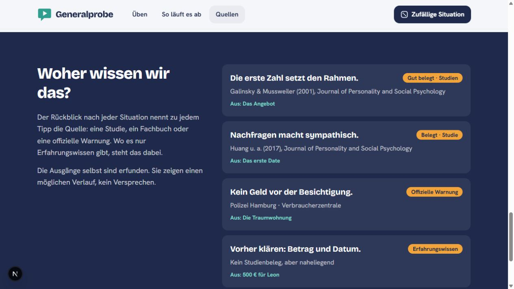

### 6. Übersicht
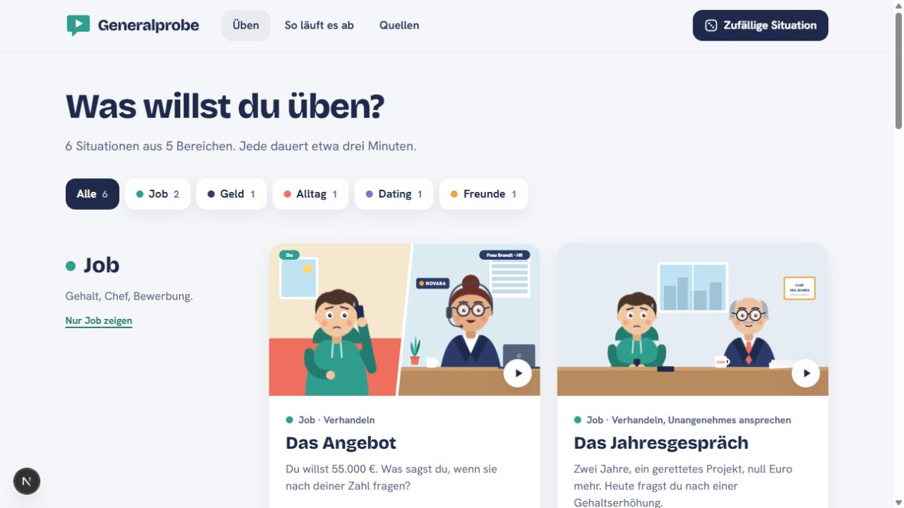

### 7. Dating-Kategorie
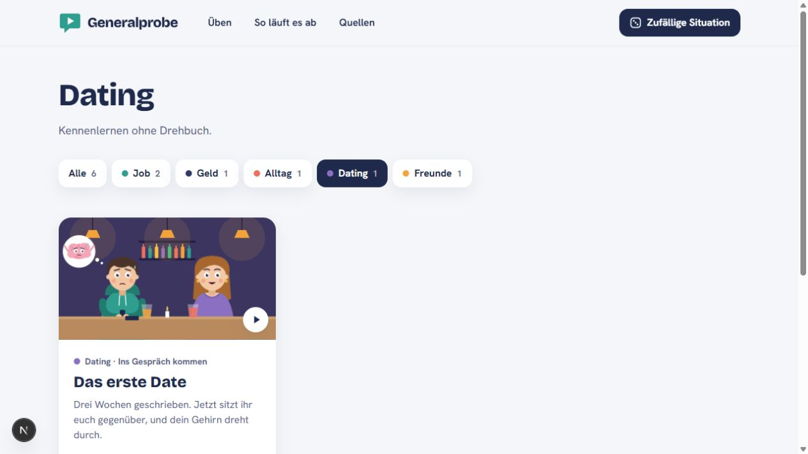

### 8. Situationsstart
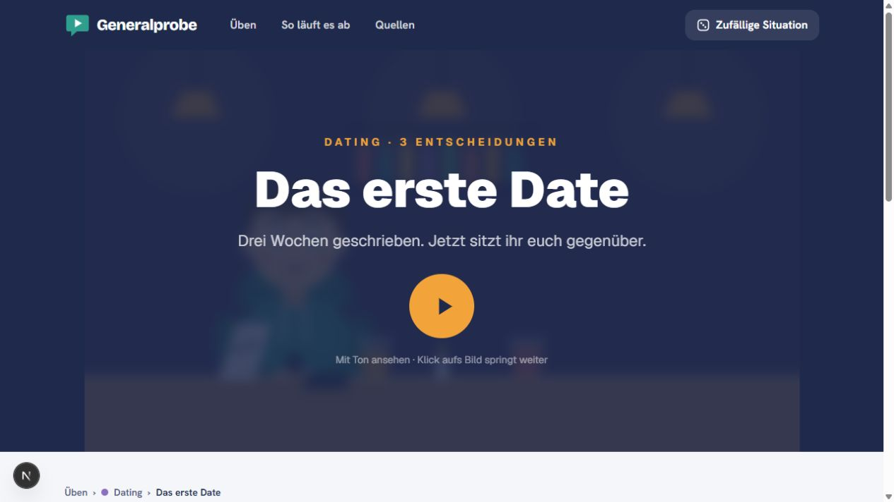

### 9. Handy-Einstieg
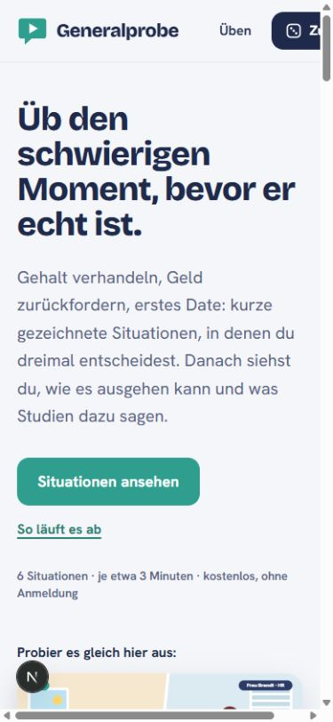

### 9b. Große Antwortflächen auf dem Handy
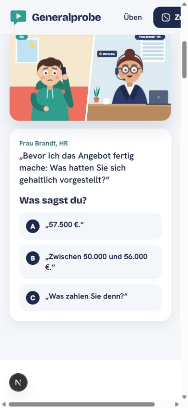

### 9c. Sehr kleine Hinweise in der mobilen Titelkarte
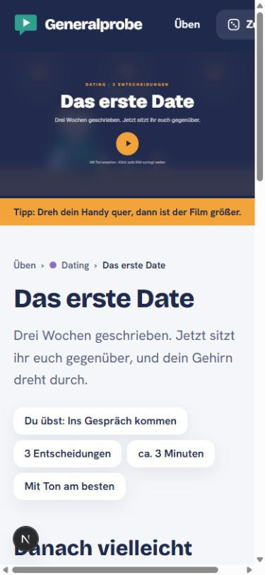

### 10. Sichtbarer Fokus nach der Antwort und Tab
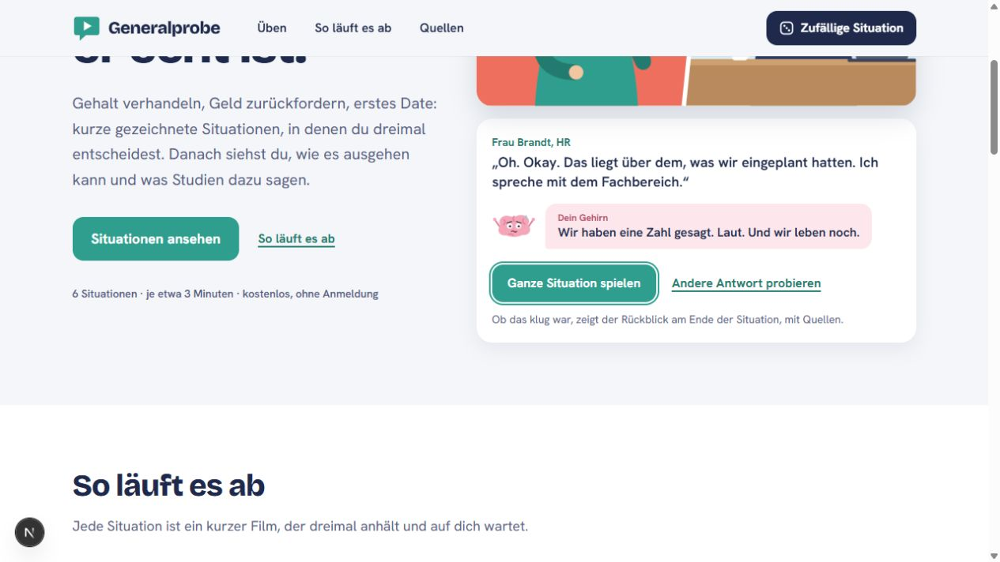
